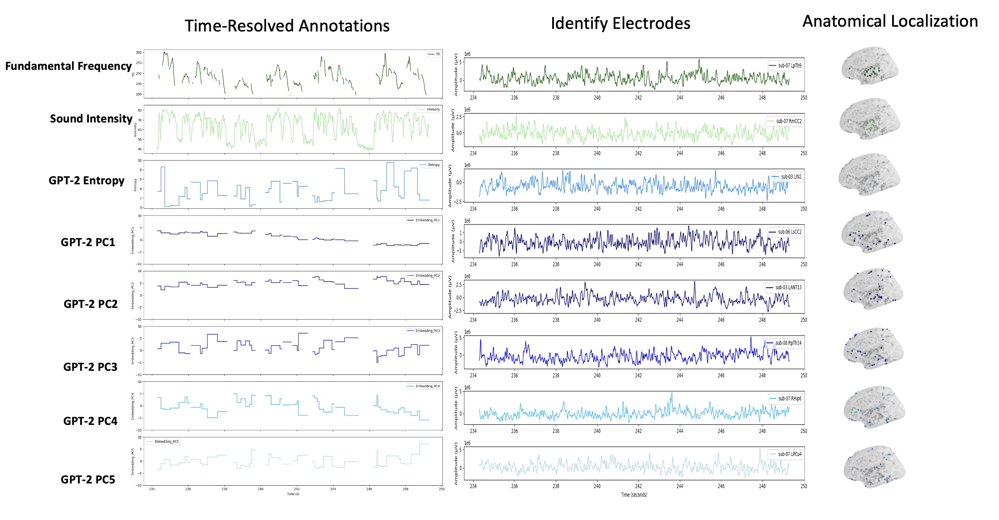
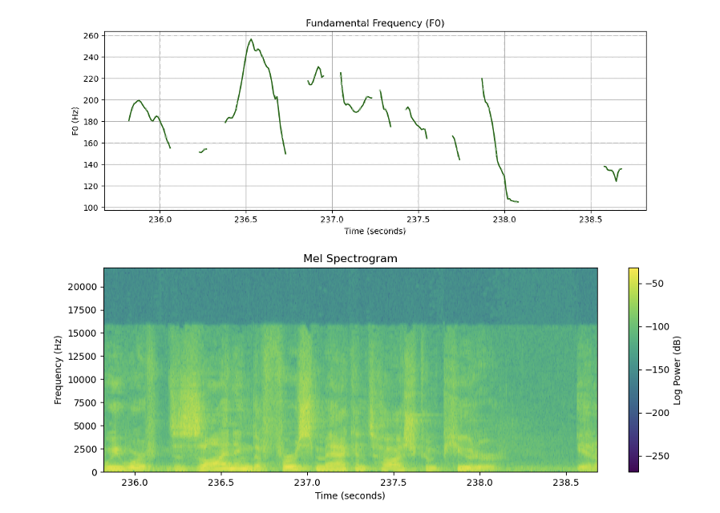
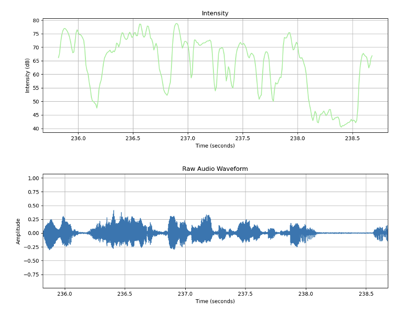
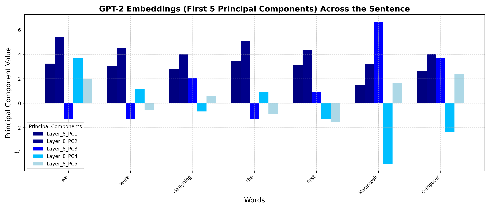
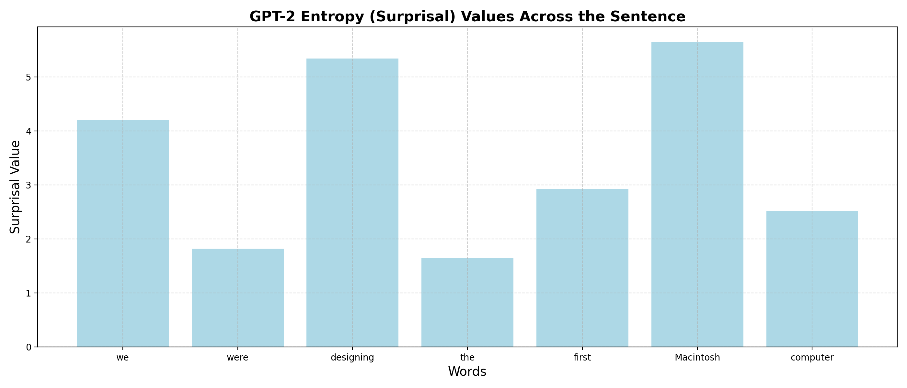
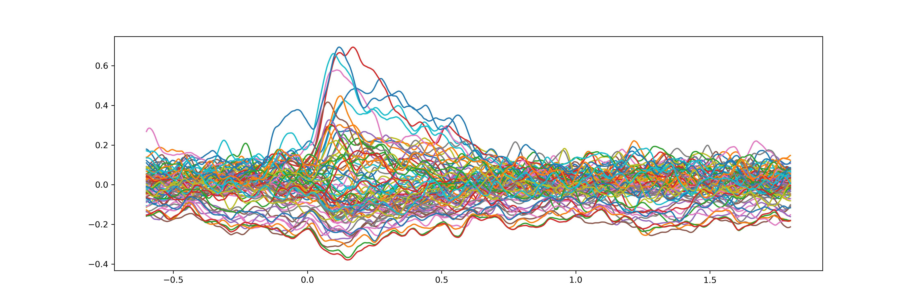
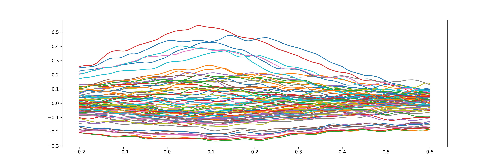

## Stereotactic Electroencephalography and Speech Processing

This repository contains code and data for preprocessing and analyzing stereotactic electroencephalography (sEEG) data aligned with audio and language features in a speech task. Our study used a set of speech stimuli, presented in two separate sessions. Speeches were divided into approximately five-minute segments, with some segments played at the original speed and others at an accelerated rate (1.25x speed). 

Intracranial data, time-resolved annotations, and stimuli are stored in Box and organized in accordance with Brain Imaging Data Structure (BIDS) format. 

### Prerequisites

Before setting up the project, ensure you have Conda installed on your system. If not, you can install it from [Miniconda](https://docs.conda.io/en/latest/miniconda.html) or [Anaconda](https://www.anaconda.com/products/distribution).

### Setup and Activate Environment 

The project uses a Conda environment to manage dependencies. The environment configuration is provided in a file named `mne_flow.yml`, which includes all necessary packages such as `mne`, `torch`, and `openai-whisper`.

#### Key Dependencies

- `mne`: For EEG data analysis.
- `torch`, `torchaudio`: For processing audio and electrode data. 
- `pysurfer`: For visualization of neuroimaging data.
- `openai-whisper`: For text transcription of `.wav` files. 
- `praat-parselmouth`: For integrating the Praat software into Python for voice analysis.

#### Environment Setup

1. **Update Conda** (optional, but recommended):

    ```bash
   conda update -n base -c defaults conda
   ```


### Dataset and Analysis

Electrode recordings are downsampled from 1,000 to 100 Hz samples in alignment with correlated feature annotations stored at every 10 ms of the stimulus.

1. We obtain canonical weights for each electrode and save these weights from highest to lowest.

2.  We compute the correlation coefficient values between electrodes (for all participants and including derivatives from 70-150 Hz and 1-40 Hz) across the four distinct feature sets.
   
3. We then take the proportion of each individual weight from the total to appropriately compare normalized weights for electrode responsiveness to audio and language features.
   
4. The dataset consists of electrodes across participants (1,116 electrodes) and nine auditory stimuli (five-minute story segments).
   
5. We concatenate the electrode recordings with 10 seconds of zero-padding between trials and then run CCA between recordings and time-resolved annotations.


<p align="middle">
  
</p>


### Annotations 

**Audio Features**

Audio Features: Fundamental Frequency (Hz) and Sound Intensity (dB)


<p align="middle">
  
  
</p>


**Language Features**

Language Features: GPT-2 Embeddings (Five Principal Components of eighth layer hidden activations) and GPT-2 Entropy  

<p align="middle">
  
  
</p>

We use language features to identify electrodes maximally responsive to language processing in the recording sessions. 


### Preprocessing 

The raw sEEG recordings are preprocessed using a pipeline implemented leveraging the MNE-Python library. Here are the initial key steps: 

#### Visualizing Stimulus Onset Time

To reproduce the visualization of the stimulus onset recorded in the microphone channel, run [stimulus-onset.py](preprocessing/stimulus-onset.py).

Below is a figure showing the stimulus onset time extracted from a representative session:

<p align="middle">
  
</p>


A 2-second sine wave was played at the beginning of each speech segment to facilitate alignment of neural responses to stimulus onset. The tone onset recorded in the microphone channel was correlated with the corresponding wav file used to identify and store the precise stimulus onset time for each presentation. This method for correlating the wav file with the microphone channel recording is particularly useful in neuroscience research using ecologically valid stimuli.  


#### Word and Phoneme Evoked Response


To reproduce the visualization of evoked response to word and phoneme onset, run [preprocessing-filtered-data.py](preprocessing/preprocessing-filtered-data.py).

Below are figures showing evoked response to word onsets (averaged response across all words) and evoked response to phoneme onsets (averaged response across all phonemes) in an individual participant over the course of a single trial.


<p align="middle">
  
  
</p>
