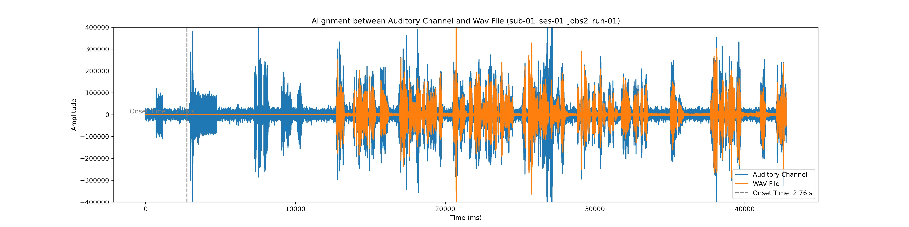

## Stereotactic Electroencephalography (sEEG) Speech Project

This repository contains code and data for preprocessing and analyzing stereotactic electroencephalography (sEEG) data aligned with audio and language features in a speech task. 

### Prerequisites

Before setting up the project, ensure you have Conda installed on your system. If not, you can install it from [Miniconda](https://docs.conda.io/en/latest/miniconda.html) or [Anaconda](https://www.anaconda.com/products/distribution).

### Setup and Activate Environment 

The project uses a Conda environment to manage dependencies. The environment configuration is provided in a file named `mne_flow.yml`, which includes all necessary packages such as `mne`, `torch`, and `openai-whisper`.

#### Key Dependencies
- `mne`: For EEG data analysis.
- `torch`, `torchaudio`: For processing audio and electrode data. 
- `pysurfer`: For visualization of neuroimaging data.
- `openai-whisper`: For text transcription of `.wav` files. 
- `praat-parselmouth`: For integrating the Praat software into Python for voice analysis.

#### Environment Setup

1. **Update Conda** (optional, but recommended):
   ```bash
   conda update -n base -c defaults conda

#### Preprocessing 

The raw sEEG recordings are preprocessed using a pipeline implemented leveraging the MNE-Python library. Here are the initial key steps: 

1. **Resampling the Electrode Data**: The electrode data is initially resampled from 10,000 Hz to 1,000 Hz. 
2. **Audio Extraction and Transcription**: The microphone channel from the raw data is saved, coverted to a `.wav` file and then transcribed using Whisper to capture both listening and speaking sessions.
3. **Stimulus Onset Time Extraction**: We extract the stimulus onset time by correlating the stimulus with the audio recorded in the channel. We save the the stimulus onset time in an events `.tsv` file in accordance with BIDS. 
4. **Visual Inspection**: For each trial, we visually inspect that the stimulus onset time extracted from the microphone channel corresponds with the raw audio used in stimulus presentation.    

****

#### Visualizing Stimulus Onset Time


To reproduce the visualization of the stimulus onset recorded in the microphone channel, run [stimulus_onset_time.py](stimulus_onset_time.py).

Below is a figure showing the stimulus onset time extracted from a representative session:

<p align="middle">
  
</p>


#### Word and Phoneme Evoked Response

<p align="middle">
  
  
</p>

**** 

### Annotations 

**Audio Features**

<p align="middle">
  
  
</p>


**Language Features**

<p align="middle">
  
  
</p>

**Features in CCA with Electrode Recordings**

<p align="middle">
  
</p>


